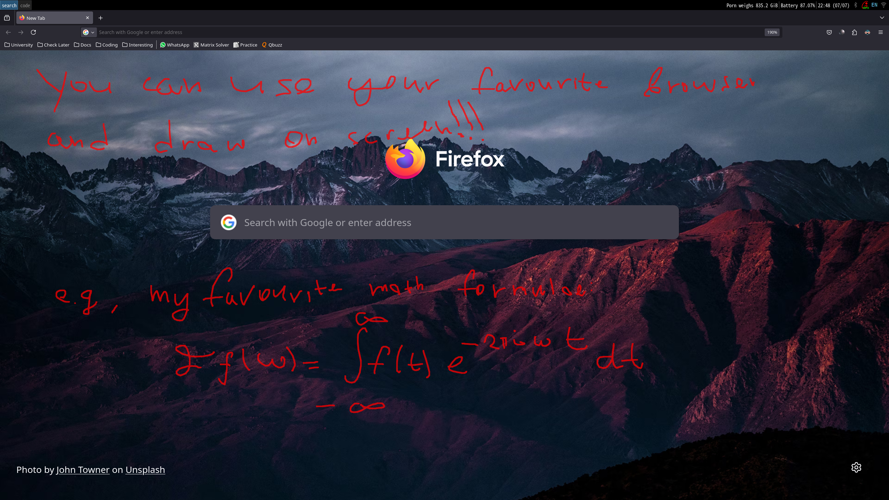
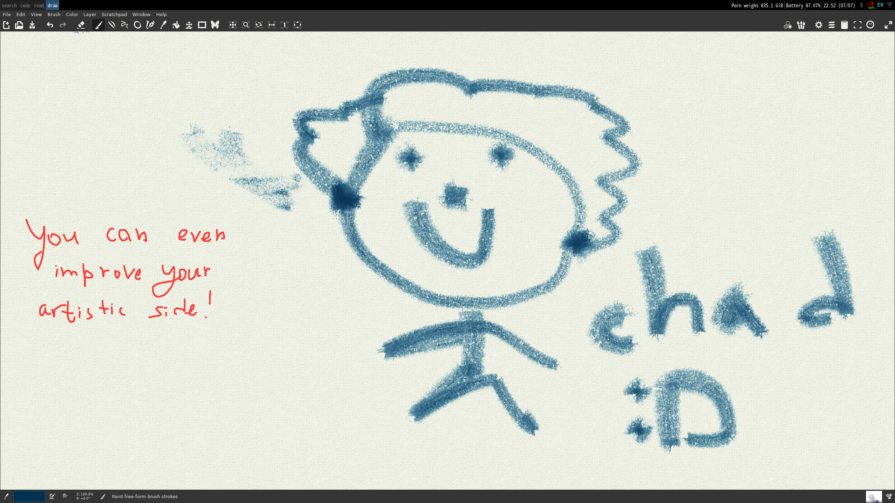
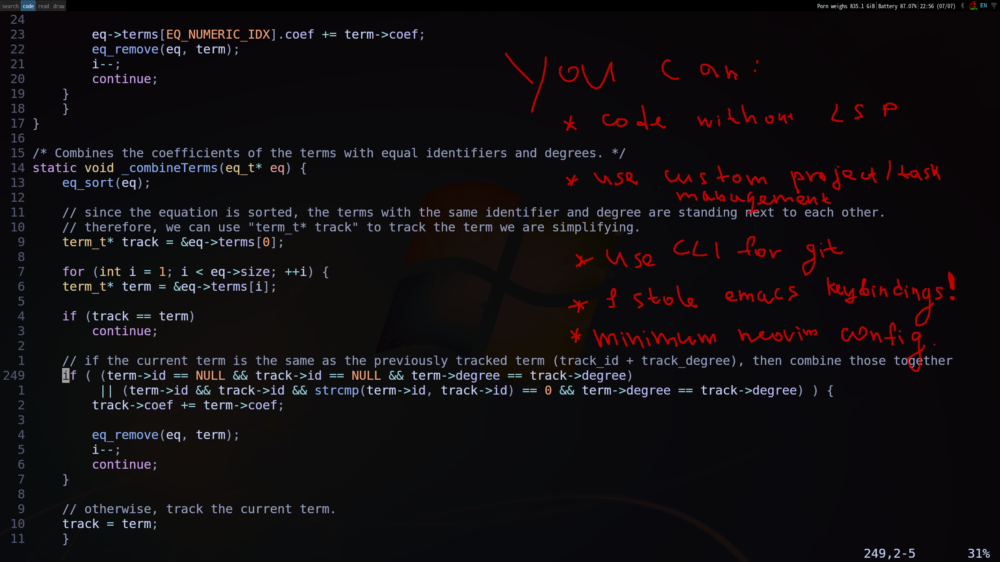
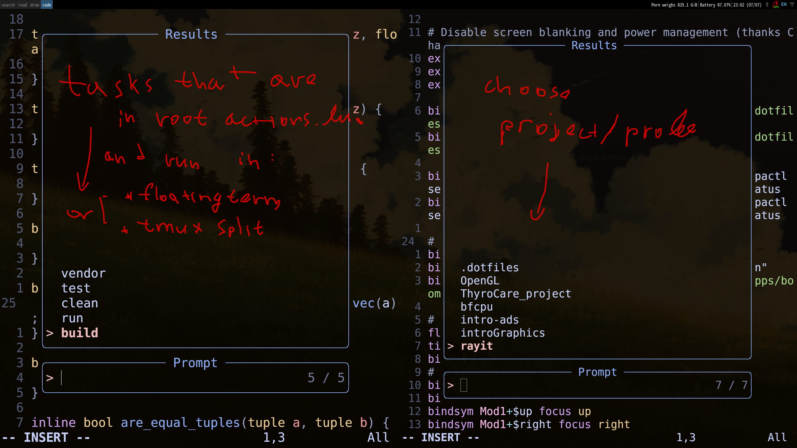
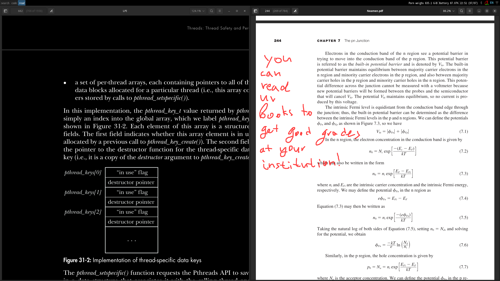

# .dotfiles
The best dotfiles that nobody should use. Objectives:
1. No complex and long configurations.
2. As few keystrokes as possible.
3. As lean as possible.
4. Very easy to install and use if* you have some technical skill to debug.

* *I only mention straightforward requirements, and I expect the victim (user) to figure out the other dependencies and requirements by him/herself.*

# Requirements

Ensure you have the following installed:
- boomer (put executable under ~/apps)
- i3lock
- scrut
- tmux
- kitty
- neovim
- i3wm
- ohmyposh
- stow
- feh
- PulseAudio
- drun
- GromitMPX
- desire to fix bugs on your system (e.g., installing requirements I haven't mentioned above)

In .bashrc add the following line to use oh-my-posh:

```bash
eval "$(oh-my-posh init bash --config ~/.config/bash-lambda-theme.json)"
```

# Show-off






